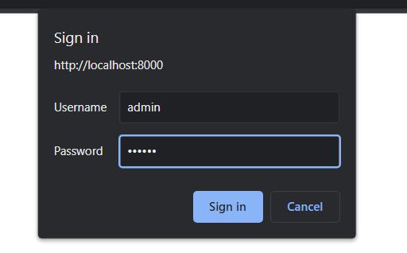
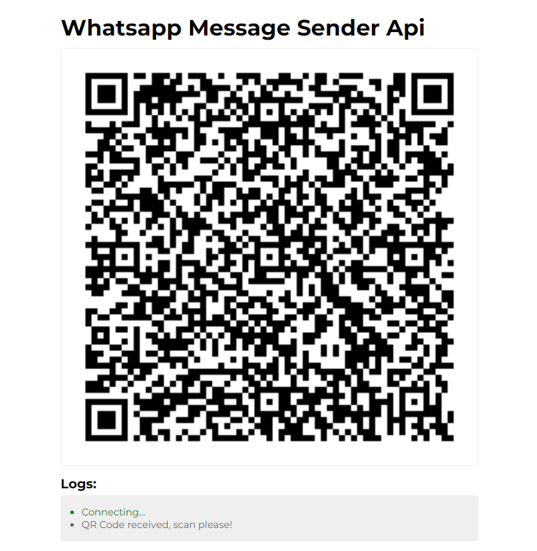
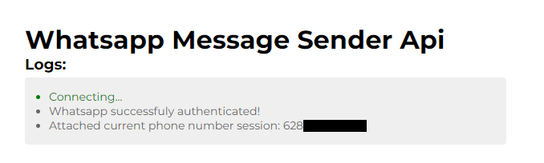
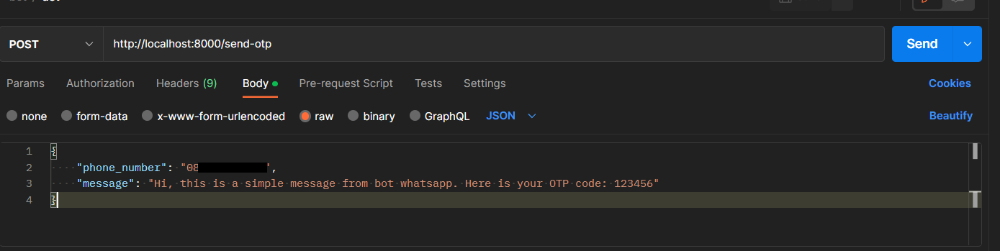
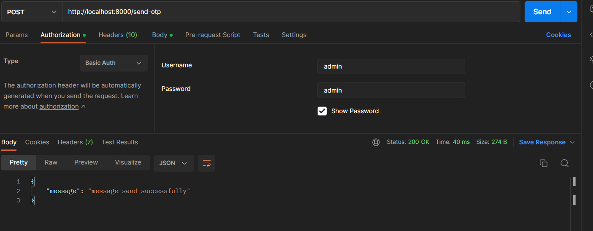
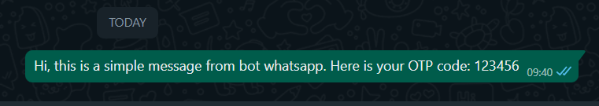

### Whatsapp Bot Js
Just a basic usage whatsapp bot to send simple message using express.js

### Technologies :
<ul>
<li>"dotenv": "^16.0.3"</li>
<li>"express": "^4.18.2"</li>
<li>"express-basic-auth": "^1.2.1"</li>
<li>"http": "^0.0.1-security"</li>
<li>"nodemon": "^2.0.20"</li>
<li>"qrcode": "^1.5.1"</li>
<li>"qrcode-terminal": "^0.12.0"</li>
<li>"socket.io": "^4.6.0"</li>
<li>"whatsapp-web.js": "^1.19.3"</li>
</ul>

### Basic Usage :
1. <code>git clone https://github.com/Yudas1337/whatsapp-bot-js.git</code>
2. rename file <code>.env.example</code> to <code>.env</code>
3. run <code>npm install</code>
4. run <code>nodemon index.js</code>
5. the service is running now open <code>http://localhost:8000</code>
6. enter the username and password for the basic auth. You can change it in <code>.env</code> file.

    

7. you will be redirected to main page, whatsapp will generate a qr code. Scan it using whatsapp mobile apps.

    

8. wait for moment until your whatsapp connected automatically, if fail just restart the service and try again.

    

9. Now, let's test it using postman. Click send button.
    
    

10. The success response will be like below. And do not forget to add basic authorization headers.

    

11. As you can see here, the message sent successfully to receiver.

     

There are more features from this library. You can get it here.. <code>https://github.com/pedroslopez/whatsapp-web.js/</code>